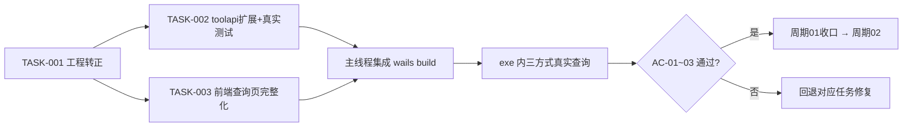

# 需求实施总览：GUI 从 walk 迁移到 Wails v2

结论：采用 Wails v2（WebView2，无 CGO、单 exe）重写 UI 层，`internal/tools`、`internal/winutil` 业务层零改动，按"双版本共存、逐页替换、最后退役 walk"的路线完成迁移；影响：本机运维工具的日常使用者（luode），迁移期间 walk 版与 Wails 版可同时使用，最终只保留 Wails 版；范围：进程占用查杀（查询三方式/结束进程/二次确认/日志）、TG 消息转发（会话登录/导出/分批转发/运行状态）、自提权接入、工程化基线；非范围：新增工具功能、数据库变更、跨平台（仍仅 Windows）、自动更新；变化：界面从 Win32 原生控件升级为理想设计稿的 Web 视觉（深色侧栏、卡片、胶囊按钮、徽章），调试方式从 VS Code F5 变为 `wails dev` 热重载；完成标准：Wails 版功能与 walk 版逐项对等并通过真实环境测试，walk 版退役删除；术语说明：toolapi 指主工程 `pkg/toolapi` 公开门面（Go internal 包不允许跨模块导入，前端绑定模块经此桥接）；验证状态：PoC 已验证"绑定调用 + 端口查询 + 单文件构建"闭环（2026-09-13），本总览已获用户授权开始执行周期 01。

## 1. 当前计划最终方案简要说明

- 推荐方案一句话结论：保留全部 Go 业务层，新增 `wailsapp/` 独立模块承载 Wails UI，经 `pkg/toolapi` 公开门面桥接，双版本共存直至对等验收后退役 walk。
- 主落点 / 主路径：`wailsapp/`（UI 宿主）+ `pkg/toolapi/`（桥接）+ `test/toolapi_test.go`（真实测试），`internal/` 不动。
- 为什么先走这条路线：PoC 已证明该路线可行且业务层零改动；internal 可见性规则决定了必须走公开门面；共存结构使任意阶段可回退。

## 2. 基本信息

- 对应需求文档：无独立需求文档（需求源于 2026-09-13 会话内 GUI 重设计 → walk 适配 → 技术选型 → Wails PoC 验证的连续决策）；本总览即来源对象。
- 来源对象标识（需求或 Bug）：GUI迁移WailsV2
- 当前实施文档命名主干：2026-09-13_185500_GUI迁移WailsV2_实施总览
- 对应需求与实施计划全量顺序实施方案：N/A（单一来源对象，无需跨需求总表；周期排序在本总览第 3 节）
- 实施计划完成条件（`AC-*`）所在章节：第 5 节各最小任务与第 9 节真实测试安排
- 对应 `6-review` 风格回归记录：周期收口时生成 `doc/6-review/{datetime}_GUI迁移WailsV2_6-review.md`（尚未产生）
- agent 理解的问题 / 目标：walk（Win32 原生控件）质感无法达到已确认的理想设计稿；在"纯 Go、无 CGO、单 exe"约束下迁移到 Wails v2，使理想稿 100% 落地且业务逻辑零改动。
- 当前计划范围：周期 01–04 全部内容（见第 3 节）；本轮已获授权执行周期 01。
- 明确不在范围：新工具功能、macOS/Linux、安装器打包、自动更新、多语言。
- 当前优先闭环：周期 01 —— "三种方式查询进程并在 Wails 界面展示"的端到端闭环。
- 关键假设 / 待确认点：① WebView2 Runtime 在目标机可用（本机已验证，Google Drive 依赖同一运行时）；② 提权后 WebView2 用户数据目录 ACL 待周期 02 实测（已知风险 R-01）；③ tgtransfer_page.go 1028 行中业务与界面编排的剥离深度待周期 03 第一步探明。
- 跨会话执行入口：读取本文档第 2.3 节。
- 主项目地址、仓库类型与代码基线：`F:\windows-util-gui`，git 仓库（遵循 no-auto-git-commit，未获逐次授权不提交），Go 1.26.5，wails CLI v2.10.2。
- local 环境与依赖入口：`export GOPROXY=https://goproxy.cn,direct GOSUMDB=sum.golang.google.cn`；构建 `wails build`（CLI 位于 `$(go env GOPATH)/bin/wails`）；walk 版构建仍走 `.vscode/tasks.json`。
- 外部项目代码引用：见第 2.3 节 EXT-001。
- 当前状态：周期 01 执行中。
- 是否已获得开始实施授权：是（用户 2026-09-13 指令"按照刚刚落盘的md计划开始执行，允许多agent并行"）。

### 2.3 跨会话独立执行与外部项目代码引用清单

- 新会话接手第一步：读本总览 → 核对第 5 节最小任务闭环状态 → 从第一个未收口任务继续。
- 主项目地址与项目根：`F:\windows-util-gui`。
- 主项目代码基线：`internal/` 未改动；`pkg/toolapi`、`wailsapp/` 为本需求新增。
- 计划源文件与版本：本文件。
- 依赖安装、local 配置和服务启动入口：见第 2 节 local 环境行。
- 中断点核验顺序：① `wails build` 是否绿；② `go test ./test/ -run TestToolAPI` 是否通过；③ 对照第 5 节任务闭环状态表。

| 引用 ID | 外部项目名称 | 外部项目地址 | 版本 / 提交 | 项目根相对路径 | 文件 / 符号 | 引用用途 | 许可证 / 复制边界 | 可达性检查与失败停止条件 | 使用回指 |
| --- | --- | --- | --- | --- | --- | --- | --- | --- | --- |
| EXT-001 | wailsapp/wails | https://github.com/wailsapp/wails | v2.10.2（已 go install CLI 并 go mod 依赖） | go.mod 依赖，未复制源码 | wails.Run / options.App / assetserver | UI 宿主框架 | MIT，仅依赖不复制 | `wails build` 失败即停，检查 GOPROXY | TASK-001/002 |

## 3. 实施周期总览

- 总周期说明：4 个周期，顺序推进；周期是大进度边界，执行单位是周期内最小任务。
- 周期拆分原则：每个周期产出一个可独立试用/验收的增量；周期内按"实现 → 真实测试 → 6-review"逐任务闭环。
- 周期排序说明：01 基线与查询闭环 → 02 结束进程与提权 → 03 TG 消息转发 → 04 打磨与退役 walk。

**周期 01 —— 工程基线与查询闭环（第一期）**
- 期次定位：第一期，从 PoC 到可日常试用。
- 周期目标：`wailsapp/` 转正；查询支持端口/PID/进程名三方式；界面按理想稿完整化。
- 包含最小任务：TASK-001（工程转正）、TASK-002（toolapi 查询扩展 + 真实测试）、TASK-003（前端 tokens 与查询页完整化）。
- 执行顺序：TASK-001 →（TASK-002 ∥ TASK-003，写集互斥可并行）→ 主线程集成构建 → 真实测试收口。
- 进入条件：PoC 已验证（已满足）。
- 收口条件：AC-01～AC-03 全部通过。
- 完成标志：三方式查询在 exe 中实测通过；周期 01 部分在追踪附录标记 DONE。
- 与前后周期衔接：产出 toolapi.Query 稳定契约供周期 02 复用。

**周期 02 —— 结束进程与提权（第二期）**
- 周期目标：补齐危险操作与权限闭环。
- 最小任务：TASK-004（Kill 绑定 + 二次确认弹窗逐条列出 + 保护名单拦截提示）、TASK-005（自提权接入 + R-01 ACL 双顺序实测）。
- 进入条件：周期 01 收口。收口条件：杀进程前后查询结果一致验证、提权/降级双顺序启动实测。
- 衔接：为周期 03 提供权限与确认交互范式。

**周期 03 —— TG 消息转发（第三期）**
- 周期目标：迁移 tgtransfer 全功能。
- 最小任务：TASK-006（逻辑下沉：把 tgtransfer_page.go 的界面编排剥离为 tools 层步骤化 API，探明并记录剥离深度）、TASK-007（会话登录 + 扫码 + 网络探测页）、TASK-008（导出 + 聊天列表模态）、TASK-009（分批转发 + EventsEmit 进度/日志 + 停止/清历史）。
- 进入条件：周期 02 收口。收口条件：真实 tdl 会话全链路（登录→导出→试转发→正式转发→中途停止）。
- 风险：TASK-006 剥离深度是本计划最大不确定点，若超出预估回本总览补周期。

**周期 04 —— 打磨与退役 walk（第四期）**
- 最小任务：TASK-010（错误/空/加载态统一 + 图标 + README/CLAUDE.md/.vscode 更新）、TASK-011（观察期后删除 internal/ui 与 walk 依赖，更新改动日志；删除前需用户逐次授权确认）。
- 进入条件：周期 03 收口且并存观察无回归。

## 4. 阶段计划

- 阶段 1（周期 01 内）：名称"桥接与界面并行开发"；只做一件事：按冻结契约分别扩展 Go 绑定与前端页面；输入：PoC 代码 + 本总览契约；输出：toolapi.Query、test/toolapi_test.go、tokens.css、查询页完整前端；验证门槛：go test 通过 + 双方按契约自检。
- 阶段 2（周期 01 内）：名称"集成与真实测试收口"；只做一件事：主线程 wails build + 三方式真实查询测试 + 6-review；输入：两路并行产物；输出：可试用 exe + 测试证据；验证门槛：AC-01~03。

## 5. 最小任务清单

**TASK-001 工程转正（所属周期 01，顺序 1，阶段 1）**
- 只做这一件事：`wails-poc/` 更名 `wailsapp/`，模块名、wails.json 元信息同步。
- 实现产出：目录更名 + go.mod module 行 + wails.json name/outputfilename（`windows-util-gui-wails`）。
- 真实测试：必需——`wails build` 绿且 exe 生成。
- 完成条件：build 绿；停止条件：build 连续 2 次失败且原因不明 → 阻断上报；阻断条件：go 工具链异常。
- 前置依赖：无；预计触达文件数：3。执行者：主线程（串行，避免与并行任务写集冲突）。

**TASK-002 toolapi 查询扩展 + 真实测试（周期 01，顺序 2，阶段 1，与 TASK-003 并行）**
- 只做这一件事：桥接层支持三方式查询并配真实环境测试。
- 实现产出：`pkg/toolapi/toolapi.go` 增 `Query(kind, value string) ([]Row, []string, error)`（kind ∈ port/pid/name，非法 kind 报错；warnings 透传）；`wailsapp/app.go` 绑定改为 `Query`；新增 `test/toolapi_test.go`。
- 真实测试：必需——`go test ./test/ -run TestToolAPI`：①起真实 net.Listen 再按端口查询必命中自身；②非法 kind/端口报错文案正确；③按进程名查 "node" 不报错（0 行也过）；非 Windows 环境 t.Skip。
- 6-review 风格回归点：注释中文、解释为什么、错误文案与 walk 版一致。
- 完成条件：go test 全绿 + AC-02；停止条件：prockill 行为与预期不符（如三方式在 walk 版语义不同）→ 回本总览补契约；前置依赖：TASK-001；触达文件数：3。

**TASK-003 前端 tokens 与查询页完整化（周期 01，顺序 2'，阶段 1，与 TASK-002 并行）**
- 只做这一件事：按理想设计稿完整化查询页前端。
- 实现产出：`wailsapp/frontend/dist/tokens.css`（色板/圆角/间距/徽章色令牌）、`index.html` 重构（侧栏+头部+查询卡+结果表+日志卡+状态行）、`app.js`（Query 三方式调用、渲染、忙碌/空/错误态、日志追加）、`app.css`。
- 真实测试：与 TASK-002 集成后在 exe 内实测（AC-01）；纯静态期以浏览器打开核对布局（不替代 AC-01）。
- 6-review 风格回归点：对照理想稿 Ardot 画布（725394321827772）视觉一致性。
- 完成条件：AC-01/03；停止条件：绑定契约与 TASK-002 产物不一致 → 上报主线程裁决；前置依赖：TASK-001；触达文件数：4。

**TASK-004～011**：见第 3 节各周期，进入对应周期时按本模板粒度展开为独立任务卡。

## 6. 现状与落点

- 涉及目录：`wailsapp/`（原 wails-poc）、`pkg/toolapi/`、`test/`、`doc/3-实施/`。
- 复用点：`internal/tools/prockill`（Query/Kill/保护名单）、`internal/winutil`（提权/RunHidden）、tdl go:embed、现有 test/ 约定。
- 需要新增的内容：见下方目录树。
- 新增文件清单：

```text
wailsapp/                                  # Wails UI 宿主工程（独立 Go 模块，replace 指向主工程）
├── main.go                                # Wails 入口：窗口/资产/绑定注册（周期02接入自提权）
├── app.go                                 # 前端绑定层：Query/IsElevated（周期02加Kill）
├── go.mod                                 # 模块 wailsapp，require wails v2.10.2 + replace 主工程
├── wails.json                             # 工程元信息与无 Node 构建配置
├── frontend/dist/
│   ├── index.html                         # 页面骨架（侧栏/头部/查询卡/结果表/日志卡）
│   ├── tokens.css                         # 理想设计稿提炼的全局设计令牌
│   ├── app.css                            # 页面布局样式
│   └── app.js                             # 绑定调用、渲染、状态与日志管理
pkg/toolapi/toolapi.go                     # 公开门面：三方式查询/权限（周期02加Kill）
test/toolapi_test.go                       # 真实环境黑盒测试（非 Windows t.Skip）
doc/3-实施/2026-09-13_185500_GUI迁移WailsV2_实施总览.md  # 本文档
```

## 7. 方案选择

- 方案 A（选定）：wailsapp 独立模块 + pkg/toolapi 门面 + 双版本共存。
- 方案 B：wails 直接放主工程根（与 walk main.go 冲突，需移动 walk 入口，共存与回退差）。
- 方案 C：Gio 纯自绘（学习曲线陡、控件全手写，周期不可控）。
- 推荐原因：A 在 PoC 中已验证，改动面最小、可回退，且 internal 可见性问题有唯一干净解。

## 8. 实施步骤（周期 01）

1. 主线程执行 TASK-001 工程转正（串行前置）。
2. 并行批次：Agent-GoBridge 执行 TASK-002；Agent-Frontend 执行 TASK-003（写集互斥）。
3. 主线程集成：`wails build` + exe 内三方式真实查询（AC-01/02/03）+ 6-review 收口。

## 9. 真实测试安排

- 真实测试总表：TASK-002 的 `go test ./test/ -run TestToolAPI`（真实 netstat/WSL 环境，非 Windows t.Skip）；TASK-003 与集成后 `wails build` 产物 exe 内三方式查询实测（端口用真实监听端口、PID 用 tasklist 实查值、进程名用 node/python）；均记录到 `doc/5-tests/`。
- 免测任务及理由：TASK-001 属纯更名，以 `wails build` 构建绿作为验证（不改变可执行行为语义）。
- 通过标准：查询结果与 walk 版同条件结果一致（行数与内容）；错误文案语义一致。
- 总体通过标准即 AC-01~03：①exe 内三种方式查询可用且结果正确；②`go test` 真实环境全绿；③界面与理想稿一致（6-review STYLE: PASS）。

## 10. 图形化执行路径



- 时序/状态图：周期 02 Kill 确认流、周期 03 EventsEmit 时序在对应周期任务卡展开。

## 11. 风险与阻断项

### 周期 03 执行契约（2026-09-13 冻结；依据 tg-explorer 对 tgtransfer_page.go 1028 行的逐函数分类）

- TASK-006 结论：UI 页 45% 为控件接线（丢弃重写）；需下沉 tools 层的不可丢弃逻辑仅 4 处——收藏夹判定、筛选类型词表、转发默认值（batch=10/delay=1/SegmentSize=1000/SegmentDelay=10）、导出记录摘要拼装。
- tools 层新增（internal/tools/tgtransfer，纯增量不改既有行为）：`IsSavedMessagesInput(text)`、`ParseSourceInput(text) (isSaved, chatID, displayName)`、`type ExportFilterOption{Label,Key}` + `ExportFilterOptions()`、`NormalizeForwardOptions(*ForwardOptions)`、`FormatExportRecordSummary(ExportRecord)`。
- 桥接层新增（pkg/toolapi/tg.go，新文件）：包内持有 DefaultConfig；暴露 `TgGetState / TgSetProxy / TgValidateNetwork / TgRefreshChats / TgRecords / TgDeleteRecord / TgStartLogin / TgCancel / TgExport / TgForward / TgClearHistory`，长任务签名统一 `ctx + logCb`。
- 绑定层（wailsapp/app.go）：TG 方法管理 goroutine/ctx 取消/事件；长任务（登录/导出/转发）立即返回，进度经 `EventsEmit` 推送：`tg:log`{line}、`tg:qr`{imagePath}、`tg:opDone`{op:"login"|"export"|"forward", ok, error}；`TgCancel()` 取消当前任务。
- 前端绑定契约（冻结）：`TgGetState()→{loggedIn,tdlPath,tdlBundled,proxy,chats[],records[]}`；`TgSetProxy(proxy)`；`TgValidateNetwork()`；`TgRefreshChats()→{chats}`；`TgRecords()→[...]`；`TgDeleteRecord(path)`；`TgStartLogin()`；`TgCancel()`；`TgExport(opts{isSavedMessages,chatId,chatName,mode:"all"|"last"|"time",lastCount,filters[]})`；`TgForward(opts{exportPath,target,mode:"direct"|"clone",dryRun,skipForwarded,reverseOrder,batchSize,delaySeconds})`；`TgClearHistory(sourceId,target)`；事件用 `window.runtime.EventsOn`。
- 前端页面：侧栏 TG 项启用 + 页面切换；TG 页三步卡片（①会话登录：状态/代理/扫码/网络测试 ②消息导出：源/范围/筛选/开始 ③分批转发：目标/模式/勾选项/批次/开始/停止）+ 聊天列表模态 + 运行状态条 + 日志区（与进程页共用日志卡样式）。
- 真实测试：tools 层新增函数单测（默认值/词表/判定规则，纯函数）；桥接层 TgGetState/Records 真实环境冒烟；登录/导出/转发的真实 tdl 链路由用户在 UI 实测（需真实 Telegram 会话）。

### 周期 02 执行契约（2026-09-13 冻结，改动必须回写本节）

- Row 结构扩展：新增 `source`（"Windows"/"WSL"）与 `distro`（WSL 发行版名，Windows 侧为空）两个 JSON 字段，Query 时从 prockill.Process 填充，供 Kill 回传使用。
- toolapi 新增：`type KillOutcome struct { Row Row; Success bool; Error string }`；`Kill(rows []Row) []KillOutcome` —— 逐条构造 prockill.Process{Source,Distro,PID,Name} 调 prockill.Kill，保护名单拒绝（IsProtected）以 Success=false + 错误文案返回，不做批量中断。
- 绑定新增：`App.Kill(rows []ProcRow) []KillOutcome`；前端把选中行的 Row 对象原样回传。
- main.go 接入自提权：`-no-elevate` flag；`!ShouldSkipElevate() && !IsElevated()` 时 `RelaunchAsAdmin()` 成功即退出、失败降级继续（与根 main.go 行为一致）。
- 前端：表格新增勾选列（36px，表头全选）；结果头新增「结束选中进程」「结束全部结果」红色描边按钮；确认弹窗逐条列出目标（来源徽章+PID+名称+端点）+ 保护提示；非管理员时弹窗内提示失败风险；Kill 后逐条写日志并自动重查。
- 真实测试（test/toolapi_kill_test.go）：真实子进程 Kill 成功且确认退出；csrss.exe（IsProtected）Kill 返回失败且进程存活。

- R-01（周期02）：提权后 WebView2 用户数据目录 ACL——双启动顺序实测，失败则将 EBWebView 目录调整到用户级可写位置。
- R-02（周期03）：tgtransfer 逻辑下沉深度未知——TASK-006 先探明，超预估则回本总览补周期，不静默扩任务。
- R-03：前端与绑定契约漂移——契约以本总览第 5 节 TASK-002 签名为唯一权威，改动必须回写总览。
- 任务停止/结束条件总表：任一任务真实测试连续 2 轮失败且无法定位 → 停止并上报，不静默重试；破坏性操作相关改动必须逐次获得用户授权。

## 12. 数据库变更 SQL

- 无（本需求不涉及数据库）。

## 13. 自审结论

- 覆盖度：范围/非范围/闭环/假设已明确；周期检查：4 周期顺序推进、每任务单周期归属；最小任务闭环：周期 01 三任务均含完成条件/真实测试/停止条件；阶段单一目标：并行阶段只做"按契约开发"一件事；占位词：无；可执行性：命令与落点均可直接执行；图文一致：Mermaid 与实施步骤一一对应；用户确认状态：已授权执行周期 01，多 agent 并行已获明确授权。

## 执行附录

- 环境变量：`GOPROXY=https://goproxy.cn,direct GOSUMDB=sum.golang.google.cn`；wails CLI：`$(go env GOPATH)/bin/wails`。
- 集成命令：`cd wailsapp && wails build`；产物 `wailsapp/build/bin/windows-util-gui-wails.exe`。
- 测试命令：`go test ./test/ -run TestToolAPI -v`。
- 回滚：删除 `wailsapp/` 与 `pkg/toolapi/` 即回到纯 walk 状态（internal/ 未动）。
- 清理：无临时资产。

## 追踪附录

- SRC：GUI迁移WailsV2（会话决策链：重设计→walk适配→选型→PoC）→ CYCLE01~04 → TASK-001~011 → TEST（doc/5-tests 待生成）→ EVIDENCE（测试文档）。
- AC 与 TASK 映射：AC-01→TASK-003+集成实测；AC-02→TASK-002；AC-03→TASK-003 6-review。
- 状态表：周期01 收口（STYLE: PASS）；周期02 收口（用户确认 Kill 与提权双顺序实测通过，R-01 关闭，STYLE: PASS）；周期03 开发完成（26 测试全 PASS，exe 已交付）；周期04 完成（2026-09-13 20:38：窗口标题带权限标识；walk 退役——删除 internal/ui、根 main.go、rsrc syso 与 walk 依赖，go.mod 仅剩 x/sys；.vscode 任务切换为 wails build/dev；README/CLAUDE.md 全面改写为 Wails 约定并保留 walk 历史经验）。**全部 11 个最小任务完成，计划收口。**测试证据：doc/5-tests/2026-09-13_190900_GUI迁移WailsV2周期01查询闭环测试.md。
- 发布与联调补充（2026-09-14）：计划收口后进入真实使用联调，共发布三个版本——**v2.0.0**（GUI 迁移 Wails v2）、**v2.0.1**（tdl 数据目录迁移到 %LOCALAPPDATA% + 旧残留清理 + 二维码 base64 推送 + 构建任务内置 wails.exe）、**v2.0.2**（TG 转发页联调修复：登录状态判定改以二维码就绪为锚点、扫码中间态与自动关窗、代理输入简化为 IP:端口、网络测试可读结果、聊天列表界面重设计、TgRefreshChats 契约缺陷修复）。生产代码变更提交 `9e2cecf`，全量测试 PASS。
- 联调阶段修复的缺陷清单（均已在 v2.0.1/v2.0.2 修复）：① WebView2 禁止 file:// 导致二维码裂图；② tdl 初始化写入被误判为授权成功（两次修正，最终以语义锚点根治）；③ `hidden` 属性被自定义 display 覆盖导致裂图与 alt 文字残留；④ 旧版数据锚定 exe 目录残留 data 空壳；⑤ `TgRefreshChats` 返回数组而前端读 `res.chats`；⑥ 网络测试为同步调用却只打印"已发起"。
